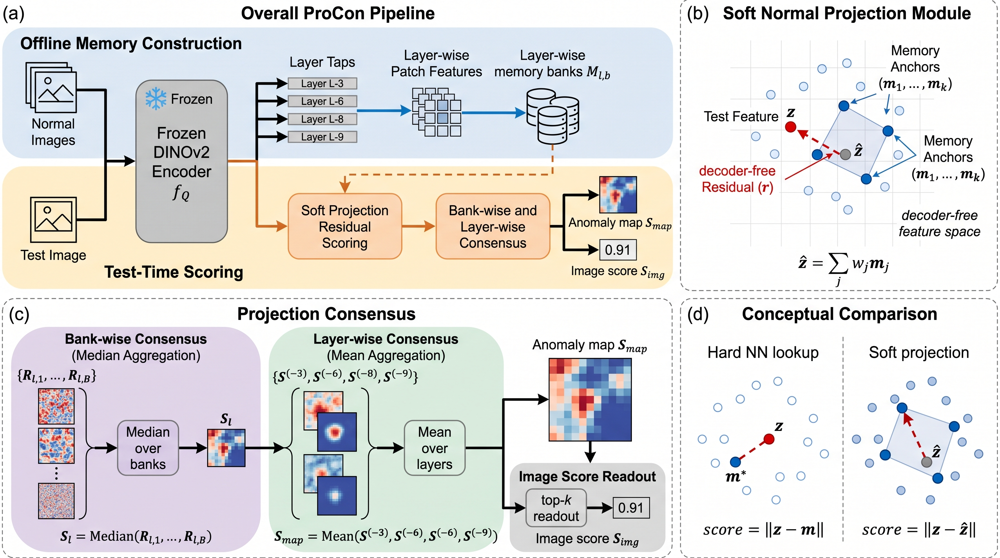

# ProCon: Training-Free Anomaly Detection via Depth-Selective Soft-Projection Consensus

**ProCon** (*Projection-Consensus*) is a **training-free** unsupervised
anomaly detection (UAD) method. It improves retrieval-based UAD purely by **redesigning the memory
bank and the scoring rule** — no decoder training, no backbone fine-tuning, no pseudo-anomaly
supervision — on top of a **frozen DINOv2 ViT-B/14**.

Each of a small pool of transformer layers `{4, 5, 7, 10}` (1-based, of 12) keeps its **own
independent 1% coreset memory** and produces a soft-projection reconstruction-residual map; the
per-layer maps are fused by a fixed mean. This *double consensus* (bank-consensus nested inside
layer-consensus) beats the soft-projection baseline on every pixel metric at the same 1% budget.



## Highlights

- **Training-free**: the only "training" is greedy k-center coreset selection on normal features.
- **Frozen backbone**: a single forward pass of DINOv2 ViT-B/14; nothing is fine-tuned.
- **1% memory budget**, identical to PatchCore.
- **Generalizes across 6 benchmarks** with the *unchanged* recipe (see table below).

## Method

```
PatchCore        hard NN retrieval, single memory bank
  + bank axis  → bank consensus (median over B seed-perturbed coresets)
  + soft proj  → soft-projection residual   r = || z − Σ_j w_j m_j ||,  w = softmax(−d²/τ)
  + layer axis → ProCon: run the residual per layer on independent memory, mean-fuse the maps
```

Each layer produces its own residual map; averaging the depth-separated maps blends the
image-level signal (deep layers) with localization (mid layers).


Full derivation, ablations, and per-category tables: [`docs/METHOD.md`](docs/METHOD.md).

## Results

All numbers are category-averaged, seed 0, with the **same recipe on every dataset**. The default operating point is a **1% coreset** (identical budget to PatchCore).

| dataset | #cat | coreset | I-AUROC | P-AUROC | P-AP | AUPRO |
|---|---|---|---|---|---|---|
| MVTec-AD | 15 | 1% | 0.9971 | 0.9862 | 0.7298 | 0.9566 |
| VisA | 12 | 1% | 0.9910 | 0.9903 | 0.5229 | 0.9695 |
| Real-IAD (single-view) | 30 | 1% | 0.9315 | 0.9904 | 0.4935 | 0.9719 |
| MPDD | 6 | 1% | 0.9740 | 0.9786 | 0.5277 | 0.9359 |
| BTAD | 3 | 1% | 0.9515 | 0.9778 | 0.7137 | 0.9292 |
| Uni-Medical (BMAD, pixel) | 3 | 1% | 0.8767 | 0.9716 | 0.5594 | 0.9075 |

### Coreset budget (MVTec-AD / VisA, all 8 metrics)

ProCon improves with the coreset budget and **peaks at 5–10%**, yet **1% already beats the soft-projection baseline at 10%** — memory-bank design matters more than budget. Best value per column in **bold**.

| dataset | coreset | I-AUROC | I-AP | I-F1 | P-AUROC | P-AP | P-F1 | AUPRO | PRO |
|---|---|---|---|---|---|---|---|---|---|
| MVTec-AD | 1% | 0.9971 | 0.9990 | 0.9924 | 0.9862 | 0.7298 | 0.7056 | 0.9566 | 0.9274 |
| MVTec-AD | 5% | 0.9975 | 0.9992 | 0.9932 | 0.9869 | 0.7347 | 0.7092 | 0.9586 | **0.9338** |
| MVTec-AD | 10% | **0.9976** | **0.9993** | **0.9940** | **0.9870** | **0.7355** | **0.7099** | **0.9588** | 0.9273 |
| VisA | 1% | 0.9910 | 0.9924 | 0.9713 | 0.9903 | 0.5229 | **0.5493** | 0.9695 | **0.9030** |
| VisA | 5% | **0.9919** | **0.9930** | **0.9746** | 0.9907 | 0.5228 | 0.5472 | 0.9703 | 0.8959 |
| VisA | 10% | 0.9915 | 0.9927 | 0.9742 | **0.9908** | **0.5232** | 0.5468 | **0.9704** | 0.8950 |

Full 8-metric and per-category breakdowns (all datasets and budgets) are in [`docs/METHOD.md`](docs/METHOD.md).

### Qualitative

Input · ground truth · nearest-neighbor memory · soft-projection memory · ProCon:


## Installation

```bash
conda create -n ad_env python=3.10 -y
conda activate ad_env
pip install -U pip
pip install -r requirements.txt
pip install -e .          # installs the `procon` package
```

Tested with Python 3.10, `torch` 2.5.1 + CUDA 12.1, `torchvision` 0.20.1 on a single 24 GB GPU.

## Datasets

MVTec/VisA-style layout is expected (datasets are **not** included in this repo):

```text
<root>/<category>/train/good/*.png
<root>/<category>/test/<defect_type>/*.png
<root>/<category>/ground_truth/<defect_type>/*_mask.png   # optional
```

Dataset roots are set per benchmark in `configs/*.yaml`. Supported: `mvtec`, `visa`, `realiad`,
`mpdd`, `btad`, `uni_medical`.

## Reproduce

```bash
# MVTec-AD + VisA (champion recipe, full 8-metric report)
bash scripts/reproduce_champion.sh

# Cross-domain benchmarks (MPDD, BTAD, Uni-Medical)
bash scripts/run_extra_benchmarks.sh

# Real-IAD, all 30 categories (single-view)
bash scripts/realiad_champion.sh
```

Or a single dataset directly:

```bash
python run_procon.py --dataset mvtec --recipe p3_drop4_3689 --output runs/mvtec
```

## Repository layout

```text
run_procon.py         # main entry point (build coreset + evaluate)
procon/               # core package
  consensus/           #   soft-projection scoring, layer-consensus runner, recipes
  models/backbones/    #   frozen DINOv2 multi-layer extractor
  memory/              #   approximate greedy k-center coreset
  data/ eval/ inference/ postprocess/ utils/
configs/               # per-dataset YAML configs
scripts/               # reproduction scripts
figures/               # figures
docs/METHOD.md         # full method + all benchmark results
```
